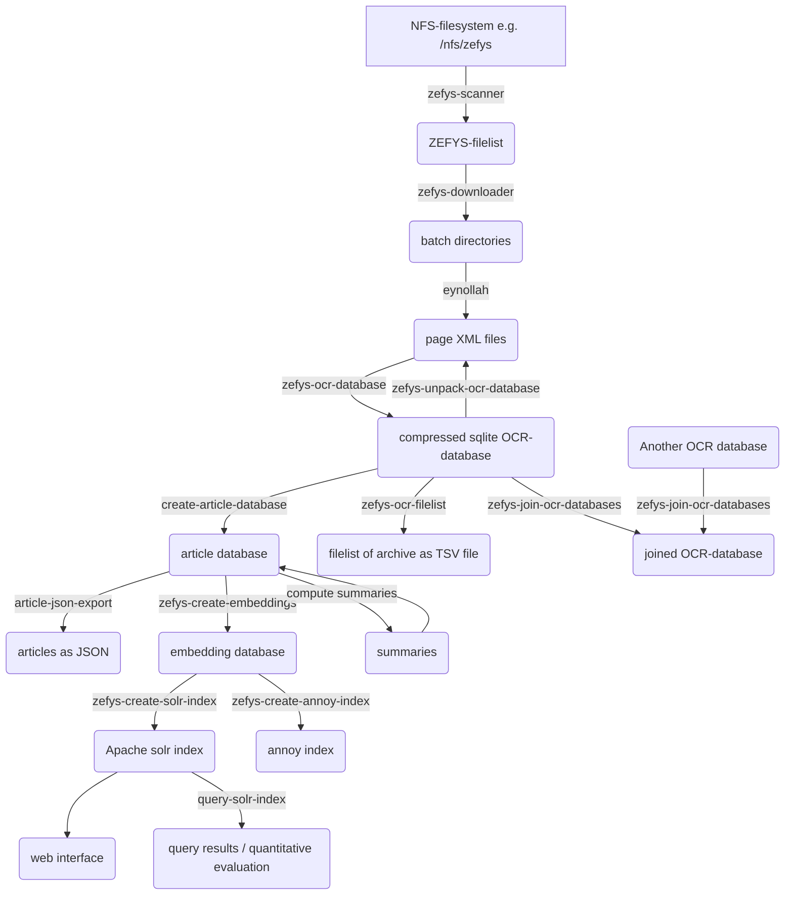

# Reading Order Article Coherence Toolbox

---

## Installation

Required python version is 3.11. 
Consider use of [pyenv](https://github.com/pyenv/pyenv) if that python version is not available on your system. 

Activate virtual environment (virtualenv):
```
source venv/bin/activate
```
or (pyenv):
```
pyenv activate my-python-3.11-virtualenv
```

Update pip:
```
pip install -U pip
```
Install RAC:
```
pip install git+https://github.com/qurator-spk/RAC.git
```


## Workflow

* [zefys-scanner](doc/CLI.md#zefys-scanner) | [zefys-downloader](doc/CLI.md#zefys-downloader)
* [zefys-ocr-database](doc/CLI.md#zefys-ocr-database) 
| [zefys-unpack-ocr-database](doc/CLI.md#zefys-unpack-ocr-database)
| [zefys-join-ocr-databases](doc/CLI.md#zefys-join-ocr-databases)
| [zefys-ocr-filelist](doc/CLI.md#zefys-ocr-filelist)
* [create-article-database](doc/CLI.md#create-article-database)
| [article-json-export](doc/CLI.md#article-json-export)
* [zefys-create-embeddings](doc/CLI.md#zefys-create-embeddings)
* [compute-summaries](doc/CLI.md#compute-summaries)
* [zefys-create-solr-index](doc/CLI.md#zefys-create-solr-index)
| [query-solr-index](doc/CLI.md#query-solr-index)
* [zefys-create-annoy-index](doc/CLI.md#zefys-create-annoy-index)

