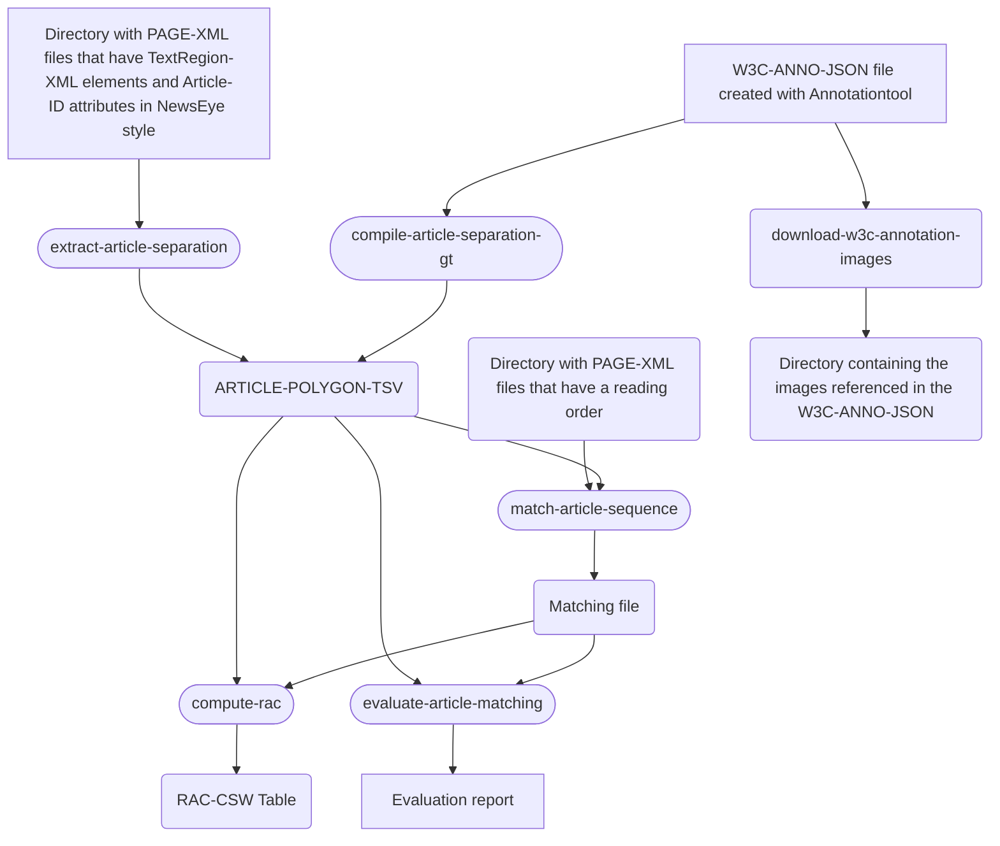

# Reading Order Article Coherence Toolbox

---

## Installation

Required python version is 3.11. 
Consider use of [pyenv](https://github.com/pyenv/pyenv) if that python version is not available on your system. 

Activate virtual environment (virtualenv):
```
source venv/bin/activate
```
or (pyenv):
```
pyenv activate my-python-3.11-virtualenv
```

Update pip:
```
pip install -U pip
```
Install RAC:
```
pip install git+https://github.com/qurator-spk/RAC.git
```


## Workflow

* [compile-article-separation-gt](doc/CLI.md#compile-article-separation-gt)
* [extract-article-separation](doc/CLI.md#extract-article-separation)
* [match-article-sequences](doc/CLI.md#zefys-unpack-ocr-database)
* [compute-rac](doc/CLI.md#compute-rac)
* [evaluate-article-matching](doc/CLI.md#evaluate-article-matching)
* [download-w3c-annotation-images](doc/CLI.md#download-w3c-annotation-images)
* [Annotationtool](https://github.com/qurator-spk/sbb_images/blob/6623081cd1b80864e6eca85ab4d7940f5045d1b8/doc/region-annotator.md)

See also [Makefile](Makefile).


## Publication

Labusch, K., Baierer, K., Bubula, M., Götze, J., Lehmann, J., Neudecker, C. (2026). Reading Order Article Coherence Dataset and Measure for Quality Assessment in Historical Newspapers. In Proceedings of the 8th International Workshop on Historical Document Imaging and Processing (HIP '26). Springer Lecture Notes in Computer Science. Springer, Cham.

## Dataset

[Reading Order Article Coherence Dataset.](https://doi.org/10.5281/zenodo.20265989)
